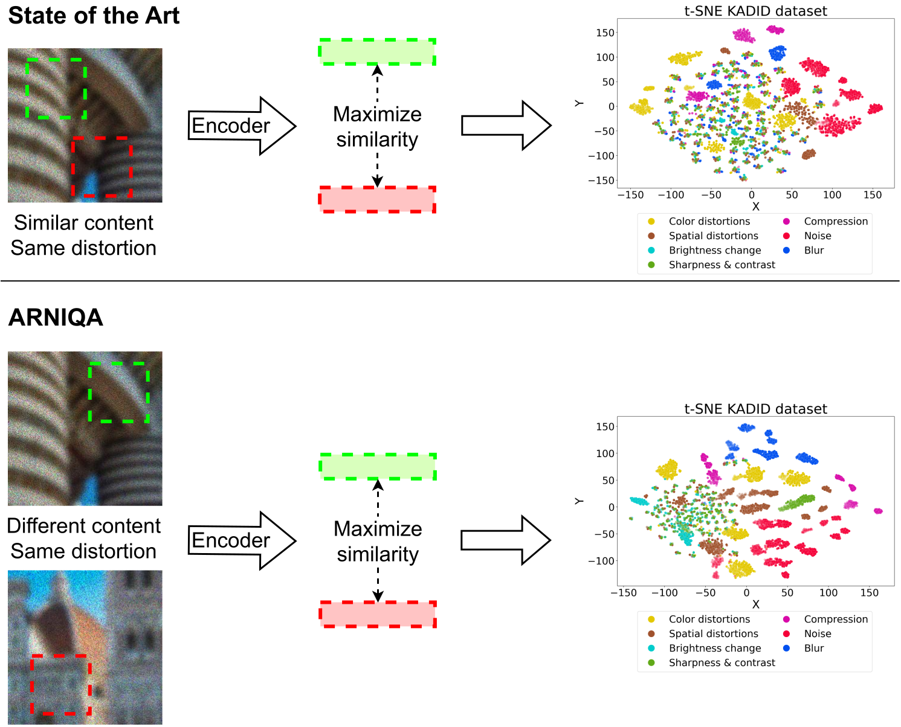

# ARNIQA (WACV 2024 Oral)

### Learning Distortion Manifold for Image Quality Assessment

[](https://arxiv.org/abs/2310.14918)
[](https://youtu.be/UUwpoi61jpg)
[](/assets/Slides.pptx)
[](/assets/Poster.pdf)
[](https://github.com/miccunifi/ARNIQA)

[](https://paperswithcode.com/sota/no-reference-image-quality-assessment-on-uhd?p=arniqa-learning-distortion-manifold-for-image)  
[](https://paperswithcode.com/sota/no-reference-image-quality-assessment-on?p=arniqa-learning-distortion-manifold-for-image)  
[](https://paperswithcode.com/sota/no-reference-image-quality-assessment-on-1?p=arniqa-learning-distortion-manifold-for-image)  
[](https://paperswithcode.com/sota/no-reference-image-quality-assessment-on-csiq?p=arniqa-learning-distortion-manifold-for-image)

**🔥🔥🔥 [2024/06/06] ARNIQA is now included in the [IQA-PyTorch](https://github.com/chaofengc/IQA-PyTorch)  toolbox**

This is the **official repository** of the [**paper**](https://arxiv.org/abs/2310.14918) "*ARNIQA: Learning Distortion Manifold for Image Quality Assessment*".

> [!NOTE] 
> If you are interested in IQA, take a look at our [new dataset](https://arxiv.org/abs/2406.17472) with UHD images and our [latest work](https://github.com/miccunifi/QualiCLIP) on CLIP-based opinion-unaware NR-IQA

## Overview

### Abstract

No-Reference Image Quality Assessment (NR-IQA) aims to develop methods to measure image quality in alignment with human perception without the need for a high-quality reference image. In this work, we propose a self-supervised approach named ARNIQA (leArning distoRtion maNifold for Image Quality Assessment for modeling the image distortion manifold to obtain quality representations in an intrinsic manner. First, we introduce an image degradation model that randomly composes ordered sequences of consecutively applied distortions. In this way, we can synthetically degrade images with a large variety of degradation patterns. Second, we propose to train our model by maximizing the similarity between the representations of patches of different images distorted equally, despite varying content. Therefore, images degraded in the same manner correspond to neighboring positions within the distortion manifold. Finally, we map the image representations to the quality scores with a simple linear regressor, thus without fine-tuning the encoder weights. The experiments show that our approach achieves state-of-the-art performance on several datasets. In addition, ARNIQA demonstrates improved data efficiency, generalization capabilities, and robustness compared to competing methods.

<p align="center">
  
</p>

Comparison between our approach and the State of the Art for NR-IQA. While the SotA maximizes the similarity between the representations of crops from the same image, we propose to consider crops from different images degraded equally to learn the image distortion manifold. The t-SNE visualization of the embeddings of the [KADID](http://database.mmsp-kn.de/kadid-10k-database.html) dataset shows that, compared to [Re-IQA](https://arxiv.org/abs/2304.00451), ARNIQA yields more discernable clusters for different distortions. In the plots, a higher alpha value corresponds to a stronger degradation intensity.

## Citation

```bibtex
@inproceedings{agnolucci2024arniqa,
  title={ARNIQA: Learning Distortion Manifold for Image Quality Assessment},
  author={Agnolucci, Lorenzo and Galteri, Leonardo and Bertini, Marco and Del Bimbo, Alberto},
  booktitle={Proceedings of the IEEE/CVF Winter Conference on Applications of Computer Vision},
  pages={189--198},
  year={2024}
}
```

## Usage

> [!NOTE] 
> If you want to employ ARNIQA just for inference, you can also use it through the [IQA-PyTorch](https://github.com/chaofengc/IQA-PyTorch)  toolbox

### Minimal Working Example
Thanks to [torch.hub](https://pytorch.org/docs/stable/hub.html), you can use our model for inference without the need to clone our repo or install any specific dependencies. By default, ARNIQA computes a quality score in the range [0, 1], where higher is better.

```python
import torch
import torchvision.transforms as transforms
from PIL import Image

# Set the device
device = torch.device("cuda") if torch.cuda.is_available() else "cpu"

# Load the model
model = torch.hub.load(repo_or_dir="miccunifi/ARNIQA", source="github", model="ARNIQA",
                       regressor_dataset="kadid10k")    # You can choose any of the available datasets
model.eval().to(device)

# Define the preprocessing pipeline
preprocess = transforms.Compose([
    transforms.ToTensor(),
    transforms.Normalize(mean=[0.485, 0.456, 0.406], std=[0.229, 0.224, 0.225]),
])

# Load the full-scale image
img_path = "<path_to_your_image>"
img = Image.open(img_path).convert("RGB")

# Get the half-scale image
img_ds = transforms.Resize((img.size[1] // 2, img.size[0] // 2))(img)

# Preprocess the images
img = preprocess(img).unsqueeze(0).to(device)
img_ds = preprocess(img_ds).unsqueeze(0).to(device)

# NOTE: here, for simplicity, we compute the quality score of the whole image.
# In the paper, we average the scores of the center and four corners crops of the image.

# Compute the quality score
with torch.no_grad(), torch.cuda.amp.autocast():
    score = model(img, img_ds, return_embedding=False, scale_score=True)

print(f"Image quality score: {score.item()}")
```

<details>
<summary><h3>Getting Started</h3></summary>

#### Installation
We recommend using the [**Anaconda**](https://www.anaconda.com/) package manager to avoid dependency/reproducibility
problems. For Linux systems, you can find a conda installation guide [here](https://docs.conda.io/projects/conda/en/latest/user-guide/install/linux.html).

1. Clone the repository

```sh
git clone https://github.com/miccunifi/ARNIQA
```

2. Install Python dependencies

```sh
conda create -n ARNIQA -y python=3.10
conda activate ARNIQA
cd ARNIQA
chmod +x install_requirements.sh
./install_requirements.sh
```

#### Data Preparation
You need to download the datasets and place them under the same directory ```data_base_path```.

1. [**LIVE**]: Download the Release 2 folder from [here](https://live.ece.utexas.edu/research/Quality/subjective.htm) and the annotations from [here](https://github.com/icbcbicc/IQA-Dataset/blob/master/csv/LIVE.txt) (corresponding to the [realigned subjective quality data](https://live.ece.utexas.edu/research/Quality/subjective.htm))
2. [**CSIQ**]: Create a folder containing the source and distorted images from [here](https://s2.smu.edu/~eclarson/csiq.html)
and the annotations from [here](https://github.com/icbcbicc/IQA-Dataset/blob/master/csv/CSIQ.txt).
3. [**TID2013**](https://www.ponomarenko.info/tid2013.htm)
4. [**KADID10K**](http://database.mmsp-kn.de/kadid-10k-database.html)
5. [**FLIVE**](https://baidut.github.io/PaQ-2-PiQ/#download-zone)
6. [**SPAQ**](https://github.com/h4nwei/SPAQ)


For each dataset, move the ```splits``` folder placed under the ```datasets``` directory of our repo under the
corresponding dataset directory under ```data_base_path```.


At the end, the directory structure should look like this:

```
├── data_base_path
|
|    ├── LIVE
|    |   ├── fastfading
|    |   ├── gblur
|    |   ├── jp2k
|    |   ├── jpeg
|    |   ├── refimgs
|    |   ├── splits
|    |   ├── wn
|    |   LIVE.txt
|        
|    ├── CSIQ
|    |   ├── dst_imgs
|    |   ├── src_imgs
|    |   ├── splits
|    |   CSIQ.txt
|        
|    ├── TID2013
|    |    ├── distorted_images
|    |    ├── reference_images
|    |    ├── splits
|    |    mos_with_names.txt
|        
|    ├── KADID10K
|    |    ├── images
|    |    ├── splits
|    |    dmos.csv
|        
|    ├── FLIVE
|    |    ├── database
|    |    |    ├── blur_dataset
|    |    |    ├── EE371R
|    |    |    ├── voc_emotic_ava
|    |    ├── splits
|    |    labels_image.csv
|        
|    ├── SPAQ
|    |    ├── Annotations
|    |    ├── splits
|    |    ├── TestImage
```

</details>

<details>
<summary><h3>Single Image Inference</h3></summary>
To get the quality score of a single image, run the following command:

```python
python single_image_inference.py --img_path assets/01.png --regressor_dataset kadid10k
```

```
--img_path                  Path to the image to be evaluated
--regressor_dataset         Dataset used to train the regressor. Options: ["live",
                            "csiq", "tid2013", "kadid10k", "flive", "spaq", "clive", "koniq10k"]
```
By default, ARNIQA computes a quality score in the range [0, 1], where higher is better.

</details>

<details>
<summary><h3>Training</h3></summary>
  
Before training, you need to download the pristine images belonging to the KADIS700 dataset. Download the ```.zip``` file from [here](http://database.mmsp-kn.de/kadid-10k-database.html) and unzip it. At the end, the directory structure should look like this:

```
├── data_base_path
|
|    ├── KADIS700
|    |   ├── ref_imgs
|        
|    ├── LIVE
|        
|    ├── CSIQ
|        
|    ├── TID2013
|        
|    ├── KADID10K
|        
|    ├── FLIVE
|        
|    ├── SPAQ
```

To train our model from scratch, run the following command:

```python
python main.py --config config.yaml
```

```
--config <str>       Path to the configuration file
```

The configuration file must contain all the parameters needed for training and testing. See ```config.yaml``` for more
details on each parameter. You need a [W&B](https://wandb.ai/site) account for online logging.

For the training to be successful, you need to specify the following parameters:

```yaml
experiment_name: <str>                  # name of the experiment
data_base_path: <str>                   # path to the base directory containing the datasets

logging.wandb.project: <str>            # name of the W&B project
logging.wandb.entity: <str>             # name of the W&B entity
```

You can overwrite all the parameters contained in the config file from the command line. For example:

```python
python main.py --config config.yaml --experiment_name new_experiment --training.data.max_distortions 7 --validation.datasets live csiq --test.grid_search true
```

After training, ```main.py``` will run the test with the parameters provided in the config file and log the results,
both offline and online. The encoder weights and the regressors will be under the ```experiments``` directory.

</details>

<details>
<summary><h3>Testing</h3></summary>
To manually test a model, run the following command:

```python
python test.py --config config.yaml --eval_type scratch
```

```
--config <str>        Path to the configuration file
--eval_type <str>     Whether to test a model trained from scratch or the one pretrained by the authors of the paper.
                      Options: ['scratch', 'arniqa']
```
If ```eval_type == scratch```, the script will test the encoder related to the ```experiment_name``` provided in the
config file or from the command line. If ```eval_type == arniqa```, the script will test our pretrained model.

</details>


## Authors

* [**Lorenzo Agnolucci**](https://scholar.google.com/citations?user=hsCt4ZAAAAAJ&hl=en)
* [**Leonardo Galteri**](https://scholar.google.com/citations?user=_n2R2bUAAAAJ&hl=en)
* [**Marco Bertini**](https://scholar.google.com/citations?user=SBm9ZpYAAAAJ&hl=en)
* [**Alberto Del Bimbo**](https://scholar.google.com/citations?user=bf2ZrFcAAAAJ&hl=en)

## Acknowledgements

This work was partially supported by the European Commission under European Horizon 2020 Programme, grant number 101004545 - ReInHerit.

## LICENSE
<a rel="license" href="http://creativecommons.org/licenses/by-nc/4.0/"></a><br />All material is made available under [Creative Commons BY-NC 4.0](https://creativecommons.org/licenses/by-nc/4.0/). You can **use, redistribute, and adapt** the material for **non-commercial purposes**, as long as you give appropriate credit by **citing our paper** and **indicate any changes** that you've made.
